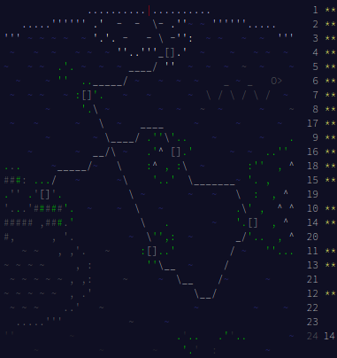

# Advent of Code 2020

Repository for solving [Advent of Code](https://adventofcode.com) in [Kotlin](https://kotlinlang.org/)

## Lessons learned

* Kotlin is `fun` to develop
    * Lots of small improvements that add up
    * Far less code
* Advent of Code Advent is a great way to improve development skills
    * Understanding and solving complex problems   
    * Proper use of collections and control flow
    * Gain insights into the world of competitive programming
* Underestimation of the effort needed to solve Advent of Code

Conclusion: Recommendation for everyone!

## Result

## Getting started

### Running

Project is already setup with gradle. To run the app:

* Navigate to top-level directory on the command line
* Run `./gradlew run` to run all days
* Run `./gradlew run --args $DAY` where `$DAY` is an integer to run a specific day

### Testing

Project includes Junit and Hamcrest and a stub unit test to get you going. To run all tests:

* Navigate to top-level directory on the command line
* Run `./gradlew test`
* Add `--info`, `--debug` or `--stacktrace` flags for more output
